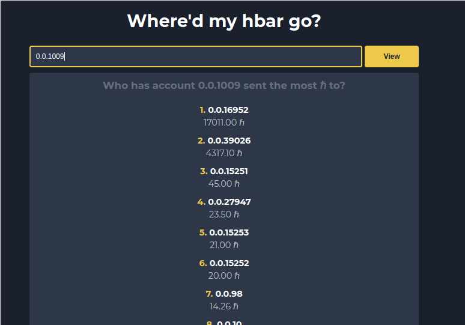

## Screenshot


## CAUTION!
This app exposes your DragonGlass API Secret on the frontend, **do not** use in production!

## Tiny little introduction 
Have you ever found yourself in the situation where your hbar is running lower than you would like, and you just can’t seem to figure out where you’re spending all of it? Well, fret no more! This app uses the DragonGlass Hedera Data API to track outgoing transactions, finally giving us us some insight into where our precious hbar is being sent!

## Getting your DragonGlass API key
To get the transaction data needed for application, we’re going to need to use an API that will let us query a hedera mirror-node. A mirror-node is a node on the hedera network that keeps a historical record of the ledger's state, but does not contribute to consensus. These mirror-nodes make it possible to query for historical data, which would be expensive to keep on the mainnet nodes. The hedera mirror-node API provider we’ll be using for this project is [DragonGlass](https://dragonglass.me). 

To get started with the DragonGlass API, we’re first going to need an account.

1. Go to [DragonGlass](https://app.dragonglass.me/hedera/signup) and sign up with your preferred email and password.
2. Once your account is created, log in at [DragonGlass](https://app.dragonglass.me/hedera/login).

Go to the top right, click the user icon, and select PROFILE from the dropdown.


Under the MY API KEYS section, press GENERATE API KEY, and copy your access key somewhere you will find it again, as it will not be shown to you again. You can also download your keys if you prefer that.  You can regenerate your keys, so don’t be too worried about losing it down the road.


Now that we have our access key, we’re good to go. You can check out more API endpoints and their responses at [DragonGlass - Live and Historical data for Hedera Hashgraph](https://app.dragonglass.me/hedera/apiview#responses).

## Running the website
First enter the DragonGlass API Secret key from the previous step into App.js 

```js
var getAccountTransactions = () => {
  var headers = {
    "x-api-key": "YOUR DRAGONGLASS API SECRET",
  };
  ...
```

Second, run the program with the command 
```
npm run start
``` 
This will host the application on localhost:3000, which you can now access in your browser.
