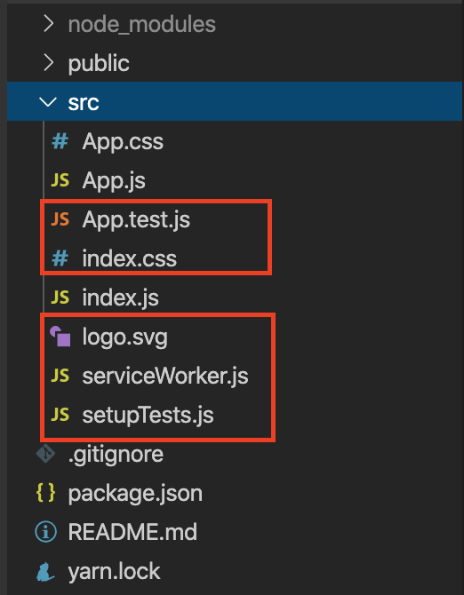
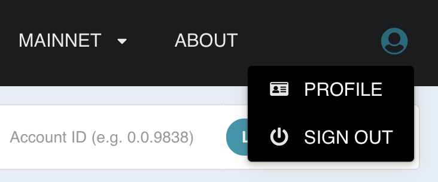
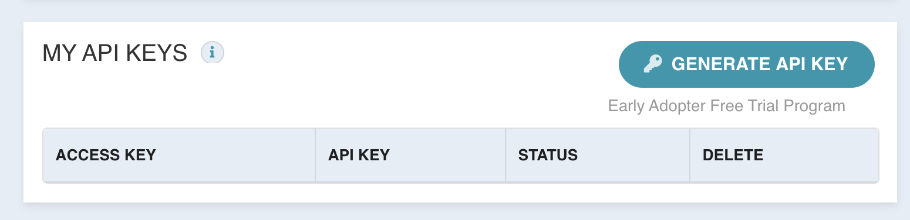
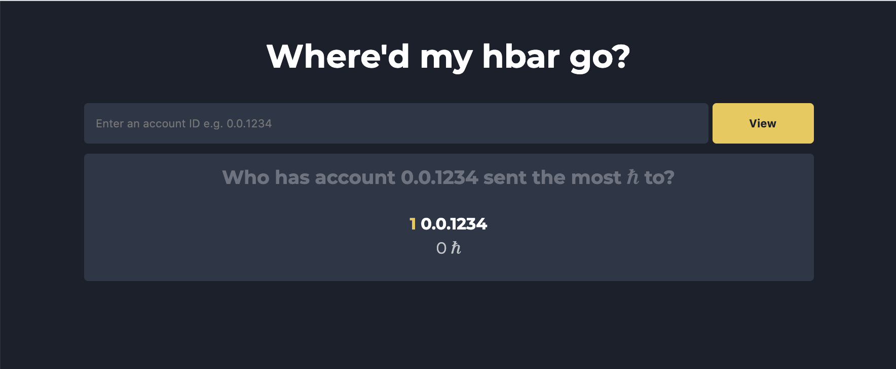
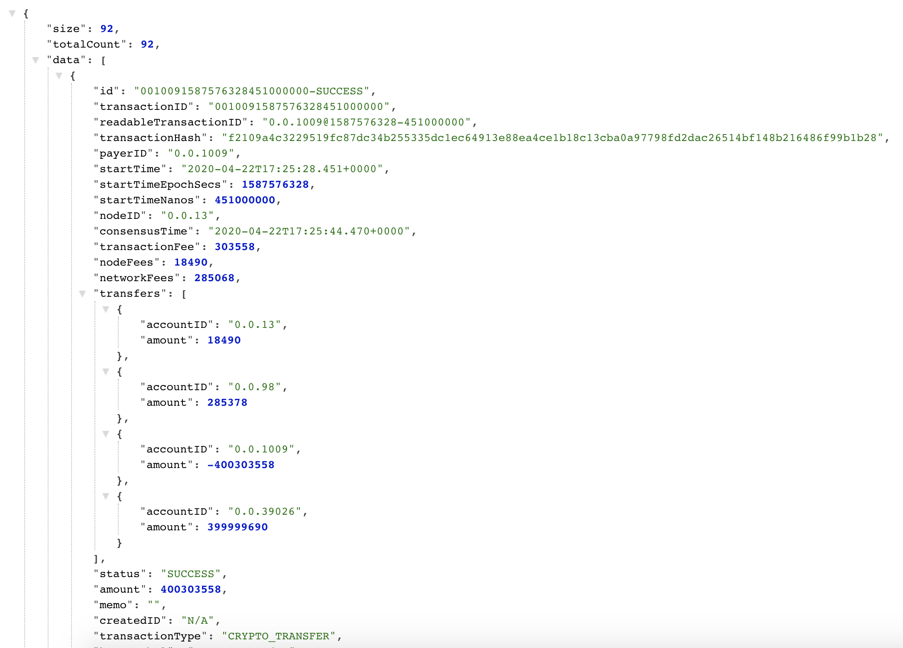

# Creating a Hedera web-app with the DragonGlass Hedera Data API

## Introduction
Have you ever found yourself in the situation where your hbar is running lower than you would like, and you just can’t seem to figure out where you’re spending all of it? Well, fret no more!  In today’s blog post we’re going to be using the DragonGlass Hedera Data API to create a web app that will track outgoing transactions and finally give us some insight into where our precious hbar is being sent!

## Prerequisites
This is an intermediate tutorial and assumes knowledge of javascript and basic of the react UI library.

You will need the following tools:
* node.js
* npm & npx (usually comes pre-installed with node.js)

## Setting up
The first step is to initialise a new react app. We’re going to use `create-react-app` for this, as it gives us a nice starting point for our application.  Let’s head over to our terminal  and use create-react-app to create a new project with the name `hbar-hunt` .

```bash
$ npx create-react-app hbar-hunt
```

Once the react app has been initialised, we’re going to remove some files that aren’t really needed.  Namely, the App.test.js, index.css, logo.svg, serviceWorker.js, and setupTests.js files.



At the same time, remove any references to the removed files in `App.js,` and `index.js`. While we’re at it, let’s also replace the contents of `App.css` with this custom CSS that I have written to save you the time. We’re here for hedera.

```css
html, body {
  font-family: ‘Montserrat’, sans-serif;
  color: white;
  height: 100%;
  width: 100%;
  margin: 0;
  padding: 0;
}

html {
  font-size: 16px;
  line-height: 1.5;
}

body {
  background-color: #1a202c;
}

.container {
  padding: 10px;
  width: 96%;
  max-width: 720px;
  min-width: 320px;
  margin-left: auto;
  margin-right: auto;
}

.page-header {
  color: white;
  text-align: center;
}

#search-form {
  height: 40px;
  display: flex;
}

#search-form input {
  flex-grow: 1;
  outline: none;
  padding: 10px;
  color: #fff;
  background-color: #2d3748;
  border-radius: 4px;
  border: 2px solid #2d3748;
}

#search-form input:focus {
  border: 2px solid #ecc94b;
}

#search-form button {
  width: 100px;
  outline: none;
  margin-left: 4px;
  border-radius: 4px;
  border: none;
  background-color: #ecc94b;
  color: #1a202c;
  font-weight: bold;
  transition: background-color linear .2s;
}

#search-form button:hover{
  cursor: pointer;
  background-color: #f6e05e;
}

.leaderboard {
  text-align: center;
  margin-top: 10px;
  padding: 10px;
  border-radius: 4px;
  background-color: #2d3748;
}

.leaderboard-title {
  color: rgba(255,255,255,0.3);
  margin: 0;
  padding-bottom: 10px;
  font-size: 14pt;
}

.leaderboard-entry {
  margin: 10px;
}

.ranking-account {
  font-weight: bold;
}

.ranking-amount {
  color: rgba(255, 255, 255, 0.7)
}

.ranking-number {
  color: #ecc94b;
  font-weight: bold;
}
```

Alright, phew, now that’s over, let’s get to creating the app!

## Getting your DragonGlass API key
To get the transaction data needed for application, we’re going to need to use an API that will let us query a hedera mirror-node. A mirror-node is a node on the hedera network that reflects the state of the ledger but does not contribute to consensus. These mirror-nodes make it possible to query for transaction data without requiring the same fees that it would cost to directly query the main-net nodes. The hedera mirror-node API provider we’ll be using for this project is [DragonGlass](https://dragonglass.me). 

To get started with the DragonGlass API, we’re first going to need an account.

1. Go to [DragonGlass](https://app.dragonglass.me/hedera/signup) and sign up with your preferred email and password.
2. Once your account is created, log in at [DragonGlass](https://app.dragonglass.me/hedera/login).

Go to the top right, click the user icon, and select PROFILE from the dropdown.



Under the MY API KEYS section, press GENERATE API KEY, and copy your access key somewhere you will find it again, as it will not be shown to you again. You can also download your keys if you prefer that.  You can regenerate your keys, so don’t be too worried about losing it down the road.


Now that we have our access key, we’re good to go. You can check out more API endpoints and their responses at [DragonGlass - Live and Historical data for Hedera Hashgraph](https://app.dragonglass.me/hedera/apiview#responses).


## Building the layout
The layout of the app is quite simple. Let’s start by opening up App.js and removing the contents of the App div like such:
```javascript
function App() {
  return (
    <div className="App">
      /* Here's where our layout will go */
    </div>
  );
}
```

We’ll then add some skeleton HTML to our App div, so that we can fill in the functionality later.

```jsx
<div className="container">
   <h1 className="page-header">
      Where'd my hbar go?
   </h1>
   <form id="search-form">
      <input 
         placeholder="Enter an account ID e.g. 0.0.1234"
      />
      <button type="submit">
      View
      </button>
   </form>
   <div className="leaderboard">
      <div className="leaderboard-header">
         <h2 className="leaderboard-title">
            Who has account 0.0.1234 sent the most ℏ to?
         </h2>
      </div>
      <div className="leaderboard-body">
         <div className="leaderboard-entry">
            <span className="ranking-number">1 </span> 
            <span className="ranking-account">0.0.1234</span> 
            <br />
            <span className="ranking-amount"> 0 ℏ</span>
         </div>
      </div>
   </div>
</div>
```


That’s all of the skeleton layout code we’re going to need. It’s not very interactive right now, so let’s add a function to fetch some API data from DragonGlass. We’re going to be using the react function `useState` to keep track of which account we’re currently searching for, so import that at the top of the file.

```javascript
import React, { useState } from 'react';
```

Let’s declare some state that we will be using throughout the application as well. In the App function add the following state variables.

```javascript
  var [accountId, setAccountId] = useState("");
  var [currentAccountId, setCurrentAccountId] = useState("");
  var [topPayments, setTopPayments] = useState([]);
  var [loadingError, setLoadingError] = useState(null);
``` 

The `accountId` will hold the input of the search-bar, and the `currentAccountId` will make sure that we’re not constantly updating which account we’re searching for.  We will be updating the `topPayments` state with out own logic soon. It will hold the accounts that `accountId` has sent hbar  to, and how many hbar every account has been sent. `loadingError` is a little addition that will help us include some rudimentary error handling in case you run into troubles with the DragonGlass API and want to debug.

After we’ve defined the state, let’s define the function that we will call to update the account transactions. 

```javascript
  var getAccountTransactions = () => {
    var headers = {
      "x-api-key": "YOUR DRAGONGLASS API KEY",
    };

    fetch(`https://api.dragonglass.me/hedera/api/accounts/${accountId}/transactions?size=1000`, { headers })
      .then(res => {
        if (res.status == 200) {
          return res.json()
        } else {
          throw `Error while connecting to DragonGlass: ${res.status}`;
        }
      })
      .then(
        (result) => {
        	var accounts = {};
          result["data"].forEach((data) => {
            data["transfers"].forEach((transfer) => {
              if (transfer["accountID"] !== accountId && transfer["amount"] > 0) {
                if(!(transfer["accountID"] in accounts)) {
                  accounts[transfer["accountID"]] = 0;
                }
                accounts[transfer["accountID"]] += transfer["amount"];
              }
            })
          });

          var sortedKeys = Object.keys(accounts);
          sortedKeys.sort((a, b) => accounts[a] - accounts[b]).reverse()

          var sortedAccounts = sortedKeys.map(key => {
            return {
              accountId: key,
              amount: accounts[key],
            }
          });

          sortedAccounts = sortedAccounts.filter((account) => account.amount > 0);

          setTopPayments(sortedAccounts);
          setCurrentAccountId(accountId);
          setLoadingError(null);
        },
        (error) => {
          setLoadingError(error);
          console.error(error);
        }
      );
  };
```

Hope I didn’t scare you away with that code! Don’t worry, I’ll take you step by step through what’s going on.

First, we set our HTTP headers to include the DragonGlass API key, as required by DragonGlass. This is the `access key` that you saved while generating your API keys earlier.  *IMPORTANT* do not do this in production! This API key will be exposed to the user of the application, so do not deploy this solution if you do not want your API key to be leaked.

```javascript
var headers = {
  “x-api-key”: “YOUR DRAGONGLASS API KEY”,
};
```

After that, we fetch the 1000 latest transactions of the `accountId` account, which returns the following: 



We also check if the response was a successful status code 200 and pass the deserialized json to the next .then() block. If for some reason, the request was unsuccessful, we throw a simple error which we will use later to alert the user of our site.

```javascript
fetch(`https://api.dragonglass.me/hedera/api/accounts/${accountId}/transactions?size=1000`, { headers })
    .then(res => {
        if (res.status == 200) {
            return res.json()
        } else {
            throw `Error while connecting to DragonGlass: ${res.status}`;
        }
    })
```

In the case of a successful request, we create a new object to store the
accounts which `accountId` has interacted with and loop through every
transaction data. Every transaction consists of a few things, but we’re
interested in the `transfers` field. The transfers field includes a list of
accounts that have been debited (sent hbar) and credited (received hbar) during
the transaction. We then make sure that we’re not we’re not including the
`accountId` account, as it will have been receiving hbar over the course of the
transactions, but we don’t want to include the `accountId` in the ranking of
who has received the most hbar over the course of the transactions. 

```javascript
(result) => {
    var accounts = {};
    result["data"].forEach((data) => {
        data["transfers"].forEach((transfer) => {
            if (transfer["accountID"] !== accountId && transfer["amount"] > 0) {
                if(!(transfer["accountID"] in accounts)) {
                    accounts[transfer["accountID"]] = 0;
                }
                accounts[transfer["accountID"]] += transfer["amount"];
            }
        })
    });
```

We now have an object of accounts.
The first field will be the account ID, and the second field will be the sum of tinybar (100 millionth of an hbar) that the account has received over the course of every transaction. 
```javascript
{
	"0.0.1234": 1245124,
	"0.0.5252": 31244211,
}
```


The way we sort the object is we take the keys of the accounts object, and we sort the keys by their corresponding value in their accounts object entry. We then reverse it to order it highest to lowest. Then, we map the sorted keys to a new object called `sortedAccounts`, where the sortedAccounts.accountId will be the key and the amount will be the value accounts[key] has.
```javascript
var sortedKeys = Object.keys(accounts);
sortedKeys.sort((a, b) => accounts[a] - accounts[b]).reverse()

var sortedAccounts = sortedKeys.map(key => {
    return {
        accountId: key,
        amount: accounts[key],
    }
});
```
Just to clean up a little, we remove any accounts that had not received anything, and set the state of our application.
We can now move on to adding interactivity to the site.
```javascript
sortedAccounts = sortedAccounts.filter((account) => account.amount > 0);

setTopPayments(sortedAccounts);
setCurrentAccountId(accountId);
setLoadingError(null);
```

Add an onSubmit to the search-form to prevent it from reloading the page, and instead make it fetch our account transactions.
```jsx
<form 
    id="search-form"
    onSubmit = {(e) => {
        e.preventDefault()
        getAccountTransactions()
    }}
>
```
Also add an onChange listener to the search input, to update the accountId state when we start searching for a new account.
```jsx
<input 
    placeholder="Enter an account ID e.g. 0.0.1234"
    onChange = {(e) => {
        setAccountId(e.target.value)
    }}
/>
```

Under the form, let's add the leaderboard into a conditional statement that makes it onbly render if we've searched for an accountId, and we don't have an error. If we have an error, show that instead. We can now use JSX to update the accountId in the leaderboard-title to reflect the one we've currently searched for. Since we're only rendering the leaderboard if we've searched for an account, let's map the topPayments state for that account onto some leaderboard entries. 
```jsx
{
    currentAccountId !== "" && loadingError == null ?
    <div className="leaderboard">
        <div className="leaderboard-header">
            <h2 className="leaderboard-title">
            Who has account {currentAccountId} sent the most ℏ to?
            </h2>
        </div>
        <div className="leaderboard-body">
            {
            topPayments.map(
                (account, index) => (
                <div className="leaderboard-entry">
                    <span className="ranking-number">{index + 1}. </span> 
                    <span className="ranking-account">{account.accountId}</span> 
                    <br />
                    <span className="ranking-amount"> {(account.amount / 100000000).toFixed(2)} ℏ</span>
                </div>
                )
            )
            }
        </div>
    </div> : (
    loadingError ? <div>{loadingError}</div> : null
    )
}
```

We start by setting the ranking-number to index + 1, as the indexing starts at 0. 
```jsx
<span className="ranking-number">{index + 1}. </span> 
```

We then display the account.accountId and the account.amount. 
As the account amount is in tinybars, we need to divide it by 100,000,000 to get the hbar value. We then truncate the value to 2 fixed decimal places to clean up the view a little bit.
```jsx
<span className="ranking-account">{account.accountId}</span> 
<br />
<span className="ranking-amount"> {(account.amount / 100000000).toFixed(2)} ℏ</span>
```

Try running the application now!
